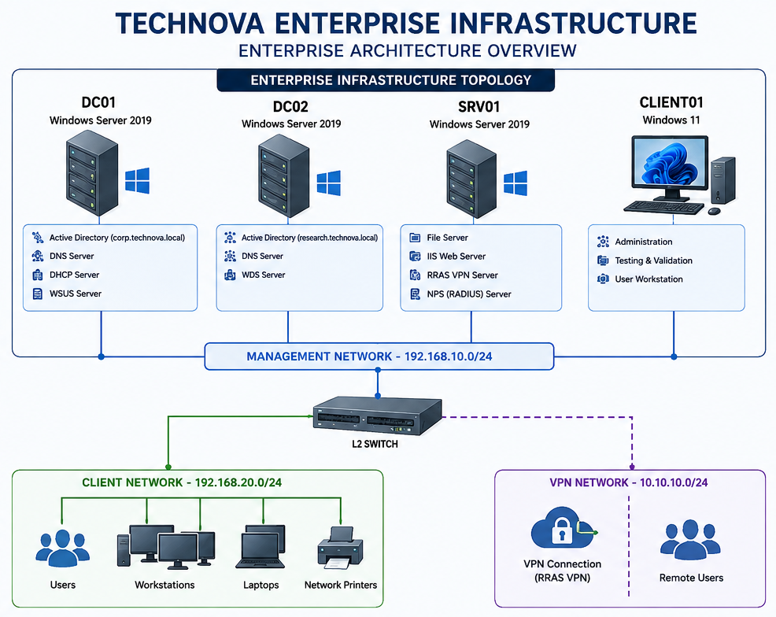

# Chapter 1 – Enterprise Architecture

---

## Enterprise Architecture Diagram

  

<b>Figure 1.</b> High-level architecture of the TechNova Enterprise Infrastructure.

---

# 1. Purpose

## Overview

The purpose of the **TechNova Enterprise Infrastructure** project is to design, deploy, automate, and document a production-style Microsoft Windows Server environment that reflects enterprise best practices.

Unlike a traditional laboratory environment, this project emphasizes repeatability, security, automation, operational readiness, and comprehensive documentation. Every component is designed as if it were to be deployed within a real organization.

The infrastructure demonstrates the practical implementation of Microsoft server technologies combined with Infrastructure as Code (IaC), configuration management, and automation tools.

---

## Objectives

The primary objectives of this project are to:

- Design a scalable enterprise infrastructure using Windows Server 2019.
- Implement a multi-forest Active Directory environment.
- Configure secure authentication and authorization mechanisms.
- Automate infrastructure deployment using Vagrant, PowerShell, and Ansible.
- Apply Microsoft security best practices and hardening guidelines.
- Produce professional documentation suitable for operational use.
- Validate the environment using automated health checks and testing procedures.

---

## Project Scope

The project includes the following technologies and services:

- Active Directory Domain Services (AD DS)
- DNS
- DHCP
- Group Policy
- File Services
- NTFS Permissions
- IIS
- Windows Server Update Services (WSUS)
- Windows Deployment Services (WDS)
- Routing and Remote Access Service (RRAS)
- Network Policy Server (NPS)
- PowerShell Automation
- Ansible Automation
- Infrastructure as Code (IaC)

---

# 2. Business Scenario

## Company Profile

TechNova is a fictional medium-sized technology consulting company specializing in software development, cloud services, and cybersecurity solutions.

The organization employs approximately **250 users** distributed across multiple departments and supports both on-site and remote employees.

The IT department requires an infrastructure capable of providing centralized identity management, secure remote access, software deployment, centralized updates, and enterprise-grade file sharing.

